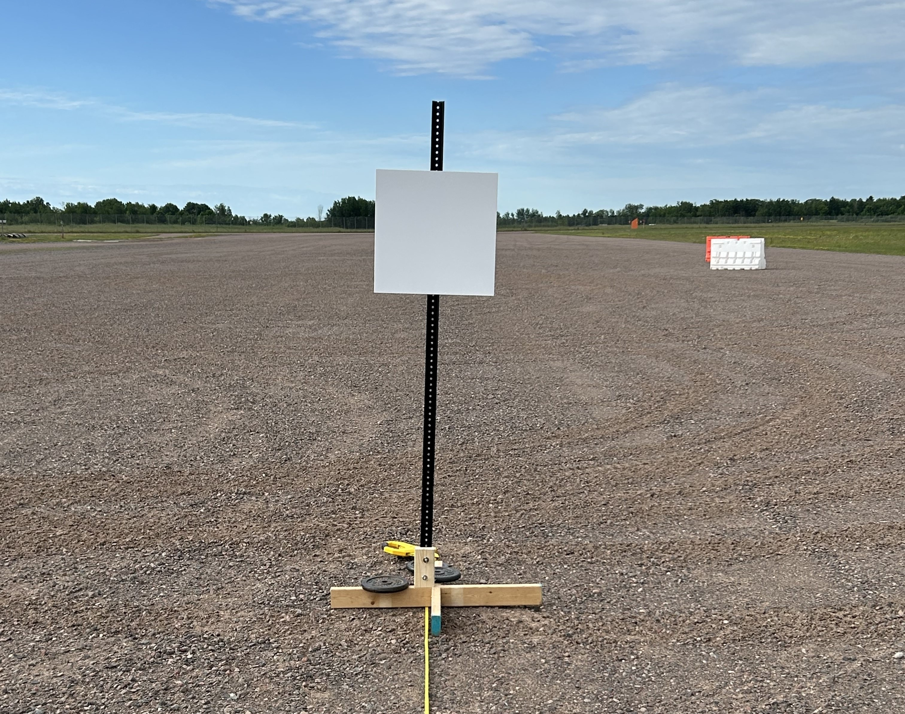
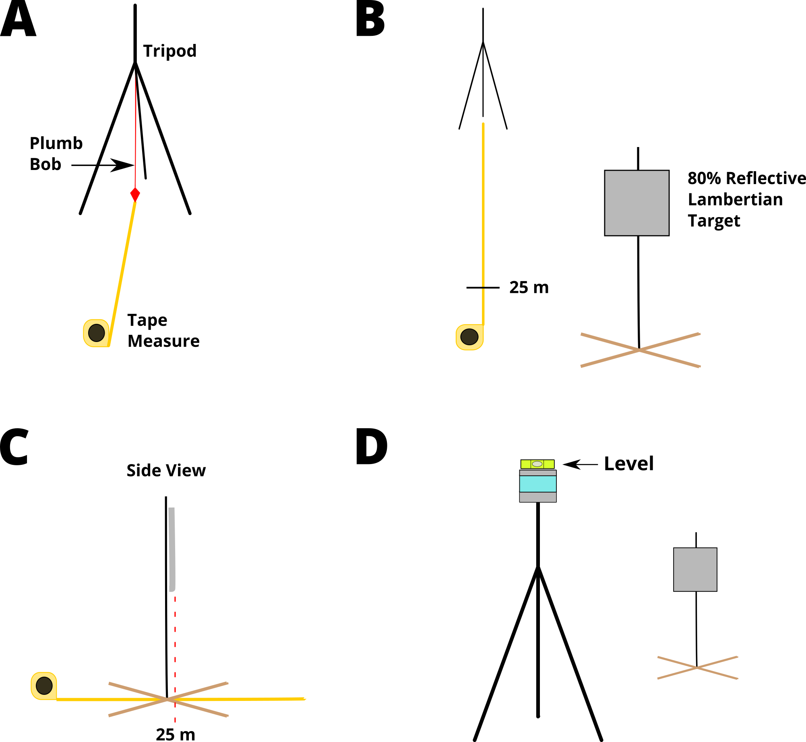

# Open Lidar Evaluation

This repo contains experiment evaluation code and data for "Assessing the Effect of Inclement Winter Weather on Automotive Lidars: Experimental Design"

A ROS package is provided to subscribe to a [PointCloud2](https://docs.ros.org/en/noetic/api/sensor_msgs/html/msg/PointCloud2.html) message from any lidar with a compatible driver and extract points on target to calculate range summary statistics.


### Repository Structure

```
open-lidar-evaluation/ 
├── data/                           # CSV points on target used in this work      
|   └── experiment 1/
|       ├── lidar A
|       |   ├── 25m
|       |   ├── 50m
|       |   └── 75m
|       └── lidar B ...
├── figures/ 
├── post_collection_analysis/                     
|    ├── processing.py              # Script to process lidar statistics
|    └── statsFunction.py           # Data processing functions                  
├── repeatability_processing/       # ROS1 package to extract target points
│   ├── launch/
|   |   └── extractPoints.launch    # ROS to CSV nodes, requires tuning
│   └── src/
|       ├── pcl_box_filter.cpp      # Publishes cropped PC2 msg
|       └── target_processor.py     # Saves range data as CSV
└── README.md   
```

## Experiment Design

With [DIN 91471](https://www.dinmedia.de/en/technical-rule/din-sae-spec-91471/366011551) as a starting point, we aim to design and quantify a low-cost, easy-to-reproduce experiment to evaluate the effect of winter weather on a lidar system.  As a first step, in this work, we quantify the experiment's uncertainty to determine the additional effect of winter weather.

A vertically mounted 0.5m x 0.5m calibrated, 80% reflective Lambertian reference target is scanned by each device under test (DUT) at 25m, 50m, and 75m. Care is taken to ensure the optical center of the DUT aligns with the center of the target.



*80% lambertian target mounted to a signpost positioned 25m downrange from the DUTs*

The front face of the target is aligned to the specified distance. Additionally, the target and lidar are leveled.  Tilt in the target is adjusted by adding small wedges under the base, and tilt in the lidar is adjusted with the tripod's ball joint.



*Pictograph of the experiment setup*

For each lidar, approximately 30 seconds of PointCloud2 messages are recorded for each target distance. A box filter is applied as a control volume immediately surrounding the target with sufficient margins. All points remaining after box filtering represent target returns.  

The range for each target return is calculated and saved as a CSV file. CSVs for all repeated trials for each lidar and target distance are processed by a [python script](./post_collection_analysis/processing.py) to return range statistics and a 95% confidence interval.

## Usage Instructions

First, install prerequisite packages:
```
$ sudo apt install ros-noetic-ros-numpy
$ pip install "numpy<1.20"  # Noetic requires older numpy to match Noetic's ros_numpy 
$ pip install scipy
```

### Control Volume Box Filter & Range Calculations

Build a new ROS workspace and clone the package:
```
$ cd ~/catkin_ws/src/
$ git clone https://github.com/Robust-Autonomous-Systems-Laboratory/open-lidar-evaluation.git
$ cd ~/catkin_ws
$ rosdep install --from-paths src --ignore-src -r -y
$ catkin_make
```

Run the node to extract all points on target. This requires tuning the box filter params in the [launch file](./repeatability_processing/launch/extractPoints.launch) to adjust the region of interest to include the specified target range and adjusting experiment trials by organizing the data output directory and filename in the [launch file](./repeatability_processing/launch/extractPoints.launch).

```
$ cd ~/catkin_ws
$ source devel/setup.bash
$ roslaunch repeatability_processing extractPoints.launch
```

### Calculating Range Statistics from CSV Range Data

Adjust the data filepaths for each lidar and each target range in the [processing.py](./post_collection_analysis/processing.py) script. This script needs to be run for each target distance for each experiment trial. Note that multiple trials for each lidar and target range combination are required for statistics calculation. Calculate range statistics with:

```
$ cd ~/catkin_ws/src/open-lidar-evaluation/post_collection_analysis
$ python3 processing.py
```

## Publication

This work is featured in "Assessing the Effect of Inclement Winter Weather on Automotive Lidars: Experimental Design" and was submitted to the 2026 IEEE International Workshop on Metrology for Automotive (MetroAutomotive).

## Acknowledgements

This work is supported by the United States National Institute of Standards and Technology (NIST) Grant 60NANB24D227.

## Maintainers
- Ian Q. Mattson, iqmattso@mtu.edu
- Jeremy P. Bos, jpbos@mtu.edu
